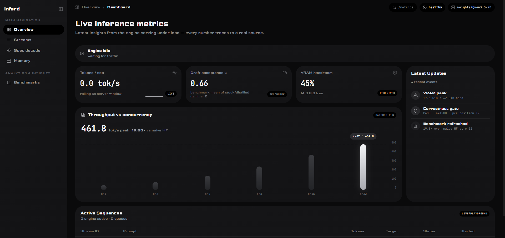
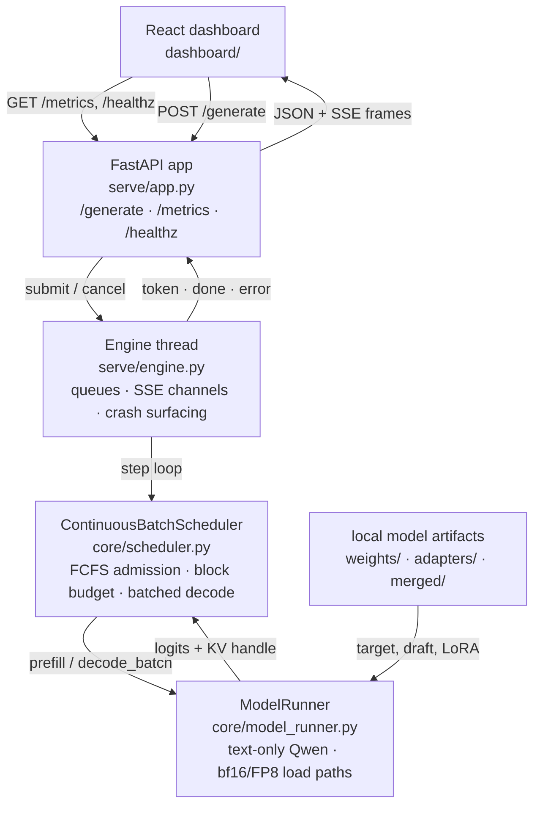
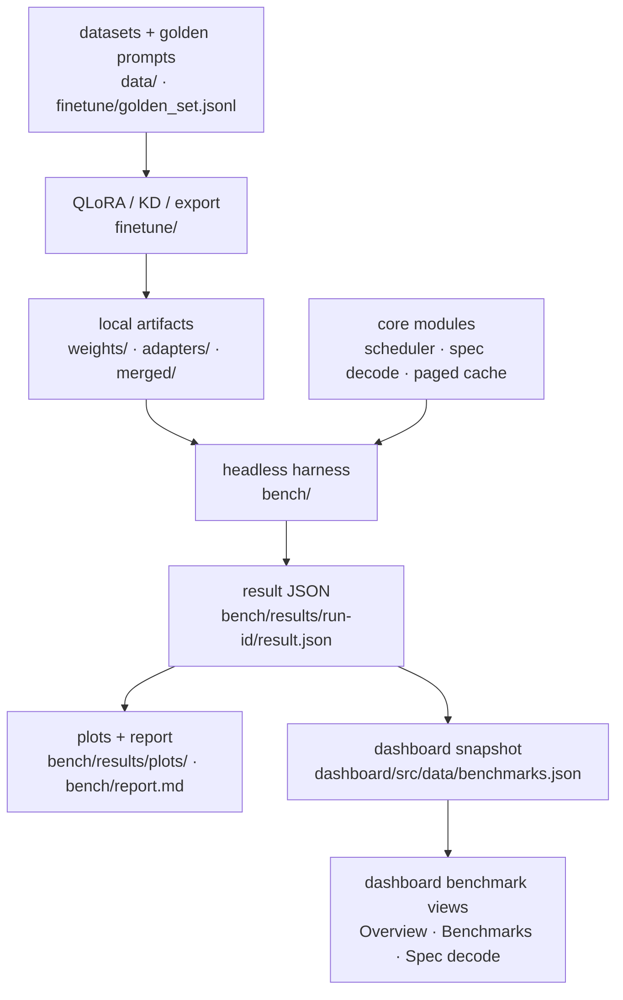

# inferd


[](LICENSE)


> **Status:** pre-release candidate. The full pipeline — fine-tuning, engine, serving, benchmarks, the FP8 27B hero, and the live **React dashboard** — is built and measured. Every number below traces to a `result.json` under `bench/results/` and regenerates from one command. Remaining release work is the under-load **demo capture** (`docs/demo.md`) and the final gate in [`docs/PRE_RELEASE.md`](docs/PRE_RELEASE.md). See [Current status](#current-status).

A from-scratch local LLM inference stack: **QLoRA fine-tuning → speculative decoding → paged KV-cache → continuous batching**, served via FastAPI with a React metrics dashboard. Benchmarked against a naive Hugging Face baseline and vLLM as the reference ceiling. Runs fully offline on a single RTX 5090 — no cloud APIs, no external inference dependencies.

The thesis is depth on both ends: fine-tune a showcase model *and* serve it through an engine you built yourself. Most projects stop at "I LoRA'd a model" or "I wrapped vLLM." This repo closes the loop.

<p align="center">
  
  <br>
  <em>The live React dashboard — streaming metrics, draft-acceptance α, VRAM headroom, and the throughput-vs-concurrency chart (naive HF · inferd · vLLM ceiling). Every number traces to a real source.</em>
</p>

See [`CONTRIBUTORS.md`](CONTRIBUTORS.md) for maintainer and assistant acknowledgements.

---

## Highlights

- **Within ~4.6× of vLLM at concurrency 32** — 450 tok/s (ours) vs 2,079 tok/s (vLLM 0.23.0) on Blackwell/sm_120, from iteration-level continuous batching. This is the *reproducible* headline (±1.3% across repeats); it also beats the naive HF floor at every concurrency — see [Results](#results).
- **Exact speculative decoding, not an approximation** — rejection sampling + residual resample, distribution-equivalence gate **PASS @ n=1500**.
- **A fine-tuned 27B served on a 32 GB card** — QLoRA adapter + load-time FP8 fits at **28.9 GiB** (an honest capacity proof, not a latency win).
- **Fully local and offline** — one-time weight download, then air-gapped; no cloud or API inference, ever.
- **Nothing faked** — every number regenerates from `bench/results/` with one command, and the live React dashboard traces each metric to a real source.

---

## What it does

| Layer | Responsibility | Status |
|-------|----------------|--------|
| **Fine-tuning** | QLoRA SFT of a 27B showpiece + 9B engine target; draft distillation for acceptance-rate lift | Implemented (`finetune/`) |
| **Inference core** | Exact speculative decoding, paged KV-cache, iteration-level continuous batching | Implemented (`core/`) |
| **Benchmarking** | Headless harness, distribution-equivalence test, throughput-vs-concurrency curves | Implemented (`bench/`) |
| **Serving** | FastAPI async queue, SSE token streaming, `/metrics` and `/healthz` | Implemented (`serve/`) |
| **Dashboard** | Live tokens/sec, TTFT, draft acceptance rate α, VRAM, concurrency | Implemented (`dashboard/`) |

---

## Quick start

**Requirements:** WSL2 Ubuntu, Python `>=3.13.14,<3.14`, RTX 5090 (Blackwell sm_120), CUDA 12.8+, [uv](https://docs.astral.sh/uv/), `gcc`/`g++` for Triton JIT, and [Bun](https://bun.sh/) for the dashboard. Full stack details in [`docs/ENVIRONMENT.md`](docs/ENVIRONMENT.md).

```bash
# 1. Install requirements (pinned in uv.lock)
uv sync
sudo apt-get install -y gcc g++   # Triton kernel JIT

# 2. Download weights (one-time; requires HF token + accepted license)
hf auth login
hf download Qwen/Qwen3.5-9B --local-dir ./weights/Qwen3.5-9B

# 3. Smoke test — load text backbone, one forward pass
uv run python scripts/smoke_load.py

# 4. Run unit tests (no GPU required for most)
uv run python -m unittest discover -s tests -v

# 5. Benchmark self-check (no GPU)
uv run python -m bench.harness --selfcheck
```

Weights, adapters, merged checkpoints, and datasets are gitignored and live under `./weights/`, `./adapters/`, `./merged/`, and `./data/` locally. See [`DECISIONS.md`](DECISIONS.md) for training artifacts and pinned choices.

---

## Requirements

Version constraints are declared in [`pyproject.toml`](pyproject.toml), exact resolved versions are pinned in [`uv.lock`](uv.lock), and dashboard packages are declared in [`dashboard/package.json`](dashboard/package.json) / [`dashboard/bun.lock`](dashboard/bun.lock). The only supported install is `uv sync` (plus `bun install` for the dashboard). Do **not** try to reproduce the environment from PyPI defaults — the pinned cu130 / sm_120 stack (e.g. `torch+cu130`, the prebuilt `causal-conv1d` wheel) is not resolvable by a plain `pip install`. The table below is a human-readable summary; `uv.lock` is the source of truth.

| Area | Requirements |
|------|--------------|
| Python | `>=3.13.14,<3.14` |
| Core ML/runtime | `torch>=2.11.0`, `transformers>=5.3.0`, `accelerate>=1.14.0`, `triton>=3.6.0`, `causal-conv1d>=1.6.1`, `flash-linear-attention>=0.5.1` |
| Fine-tuning | `unsloth>=2026.3.11`, `bitsandbytes>=0.49.2`, `peft>=0.19.1`, `trl>=0.24.0`, `datasets>=4.3.0`, `huggingface-hub>=1.21.0` |
| Serving and benchmarks | `fastapi>=0.115.0`, `uvicorn[standard]>=0.30.0`, `httpx>=0.27.0`, `matplotlib>=3.11.0` |
| Dashboard runtime | `@fontsource/jetbrains-mono^5.2.8`, `lucide-react^0.468.0`, `react^18.3.1`, `react-dom^18.3.1`, `react-router-dom^6.28.0`, `recharts^2.13.3` |
| Dashboard tooling | `@types/node^22.10.2`, `@types/react^18.3.12`, `@types/react-dom^18.3.1`, `@vitejs/plugin-react^5.0.0`, `@typescript-eslint/eslint-plugin^8.18.0`, `@typescript-eslint/parser^8.18.0`, `eslint^8.57.1`, `eslint-plugin-react-hooks^5.1.0`, `eslint-plugin-react-refresh^0.4.16`, `typescript~5.7.2`, `vite^6.0.3` |

Dashboard requirements are pinned by [`dashboard/bun.lock`](dashboard/bun.lock).

---

## Architecture

The architecture is split into two diagrams so it stays readable in GitHub's Mermaid renderer.

**Runtime request path**



**Artifacts and measurement**



| Plane | Code | Role |
|-------|------|------|
| UI | `dashboard/` | Polls `/metrics`, streams `/generate`, and renders committed benchmark snapshots without fake numbers. |
| Serving | `serve/app.py`, `serve/engine.py`, `serve/schemas.py` | FastAPI contract, SSE token stream, queue admission, cancellation, crash surfacing, and live metrics. |
| Runtime core | `core/model_runner.py`, `core/scheduler.py`, `core/batched_cache.py` | Loads the text-only Qwen backbone, owns FCFS continuous batching, stacks/splits KV caches, and runs one batched decode step per iteration. |
| Algorithm gates | `core/spec_decode.py`, `core/paged_cache.py`, `core/paged_attn.py`, `core/qwen35_patch.py` | Exact speculative decoding, paged-cache reference paths, and the Qwen hybrid-attention patch used by correctness tests and benchmarks. |
| Fine-tuning | `finetune/` | Prepares datasets, runs QLoRA/KD, evaluates golden prompts, and exports adapters or merged checkpoints for local serving. |
| Measurement | `bench/`, `tests/` | Headless harness, correctness gates, equivalence tests, plots, and `bench/report.md`; measurement does not depend on the HTTP stack. |

The serving path is intentionally thin: HTTP never owns model state. The background engine thread owns the scheduler, the scheduler treats KV as an opaque `ModelRunner` handle, and benchmarks import the same core modules directly.

---

## Repository layout

```
inferd/
├── inferd/                 # Package root: env bootstrap, CUDA lib preload
├── core/                   # Inference engine
│   ├── model_runner.py     # Shared hot file: load + forward(tokens, kv)
│   ├── spec_decode.py      # Exact rejection sampling + resample
│   ├── paged_cache.py      # Block allocator + page table
│   ├── paged_attn.py       # Paged-attention reference (Triton kernel follow-up)
│   ├── batched_cache.py    # Stack/split hybrid caches for batched decode
│   └── scheduler.py        # FCFS continuous batching
├── finetune/               # QLoRA training pipeline
│   ├── train_qlora.py      # Unsloth-first SFT entrypoint
│   ├── eval_golden.py      # Golden-set regression checks
│   ├── distill_draft.py    # Sequence-level KD for draft α-lift
│   └── export.py           # Adapter export + merge-for-serving
├── bench/                  # Headless benchmark harness (source of truth)
│   ├── harness.py          # CLI: hf / spec / paged / batched / vllm
│   ├── correctness.py      # Distribution-equivalence gate
│   ├── workload.py         # Frozen prompts + sampling profiles
│   ├── runners/            # Engine-specific runners
│   └── results/            # Pinned JSON results (append-only)
├── tests/                  # Unit + equivalence tests
├── scripts/                # smoke_load.py and other entrypoints
├── docs/                   # ENVIRONMENT.md and setup notes
├── plans/                  # Phased execution pack
│   ├── shipped/            # v1 phases 00–11 (implemented, shipped as v0.1.0)
│   └── future/             # post-v0.1.0 roadmap (00 index + phases 12–17)
├── plan.md                 # Design vision
├── DECISIONS.md            # Load-bearing decisions with dates
└── uv.lock                 # Pinned dependency lockfile
```

`dashboard/` is present (React + Vite + TS); see [`dashboard/`](dashboard/).

`core/model_runner.py` is the shared hot file — phases extend it via new methods; callers treat `kv` as an opaque handle.

---

## Models

Roles are split across Qwen generations: a 27B showpiece for fine-tuning, and a matched 9B/0.8B pair for the engine.

| Role | Model | Notes |
|------|-------|-------|
| Fine-tune showpiece | `Qwen/Qwen3.6-27B` | QLoRA only; served via FP8 in the hero demo (phase 10) |
| Engine target | `Qwen/Qwen3.5-9B` | bf16 ≈ 18 GB; leaves KV-cache headroom for batching |
| Engine draft | `Qwen/Qwen3.5-0.8B` | bf16 ≈ 1.6 GB; distilled against the fine-tuned 9B |
| Fallback drafts | `Qwen3.5-2B` / `4B` | Same family if 0.8B acceptance rate is too low |

All three checkpoints are multimodal (`qwen3_5` arch). v1 is **text-only**: load the wrapper + processor, extract the `language_model` backbone, strip the vision tower.

vLLM is recorded once as the **ceiling reference** — never a runtime dependency.

---

## Speculative decoding (exact)

Output must be **distributionally identical** to direct target sampling. The acceptance rule (Leviathan et al. 2023 / Chen et al. 2023):

```
accept x with probability min(1, p(x) / q(x))
on first rejection at position k:
    resample from residual  p_resid(x) = max(0, p(x) - q(x)) / Σ max(0, p(x) - q(x))
    discard all drafted tokens after k
if all γ accepted:
    sample one bonus token from p at the final position
```

`bench/correctness.py` exercises this via a multi-token statistical gate against a bootstrapped direct-vs-direct null envelope. Qwen3.5's hybrid linear-attention cache requires a custom parallel-verify patch (`core/qwen35_patch.py`) and snapshot/replay rollback — see `DECISIONS.md` for the honest throughput findings.

---

## Tech stack

| Area | Choices |
|------|---------|
| Fine-tuning | Unsloth first; Axolotl / Llama-Factory / ms-swift / TRL+PEFT as fallbacks. bitsandbytes 4-bit NF4. **No GemForge.** |
| Core | Python, PyTorch (Blackwell CUDA 12.8+), Triton (paged attention), Hugging Face Transformers |
| Serving | FastAPI + uvicorn, async queue, SSE streaming |
| Dashboard | React + Vite, Recharts |
| Environment | WSL2 Ubuntu, `uv` lockfile, everything pinned |
| Reference | vLLM (ceiling only) |

FP8 is the **one quantization exception**, scoped to the fine-tuned 27B hero demo only (phase 10).

---

## Current status

**All phases 01–11 are code-complete and merged to `main`**, including the live dashboard (08).
This is a pre-release candidate, not a tagged release: the remaining work is the under-load
**demo capture** (`docs/demo.md`) plus the final gate in [`docs/PRE_RELEASE.md`](docs/PRE_RELEASE.md).

| Phase | Deliverable | Status |
|-------|-------------|--------|
| 01 — Environment | Pinned WSL2 + CUDA stack; smoke test | Done |
| 02 — Harness | Reproducible HF floor + vLLM ceiling | Done |
| 03 — QLoRA | Fine-tuned 9B + 27B adapters; golden-set eval | Done (9B merged; 27B adapter restored) |
| 04 — Spec decode | Exact rejection sampling + correctness gate; α-lift | Done (correctness proven; net speedup negative on hybrid model) |
| 05 — Paged KV | Block allocator + reference paged attention | Done (runtime persistent cache TBD) |
| 06 — Batching | Iteration-level scheduler + batched decode | Done |
| 07 — Serving | FastAPI + SSE | Done |
| 08 — Dashboard | Live metrics UI | Done |
| 09 — Bench/report | Aggregated plots; one-command reproduce | Done |
| 10 — FP8 hero | Fine-tuned 27B via FP8 | Done as capacity proof; latency impractical |
| 11 — Docs | Portfolio-ready README with final numbers | Done |

### Results

Every figure below regenerates with `uv run python bench/run_all.py --plots`; plots land in `bench/results/plots/` and the full table in [`bench/report.md`](bench/report.md).

**Throughput vs concurrency — matched workload, three rungs on the stock 9B (tok/s), provenance-validated cohort:**

| concurrency | 1 | 4 | 8 | 16 | 32 |
|---|---|---|---|---|---|
| naive HF (floor) | 29.5 | 99.9 | 109.6 | 24.5 | 8.9* |
| **inferd** | **44.1** | **139.9** | **231.4** | **343.2** | **449.9** |
| vLLM (ceiling) | 85.5 | 307.8 | 631.4 | 1177.8 | 2079.1 |

<sub>*The naive HF floor at c=32 is VRAM-thrash-limited at the card's memory edge and **not reproducible** (measured 8.9–27.7 tok/s across repeats), which is why the ours-vs-HF ratio is reported as a range. The ours-vs-vLLM ceiling ratio is stable (±1.3%). See the Reproducibility section of [`bench/report.md`](bench/report.md).</sub>

- Continuous batching wins at **every** concurrency and lands **within ~4.6× of the vLLM ceiling at c=32** (450 vs 2,079 tok/s, reproducible ±1.3%). Against the naive HF floor it is **~16–50× at c=32** — reported as a *range* because the floor is VRAM-thrash-limited and non-reproducible there (KV-cache-less recompute at the card's memory edge).

| Experiment | Result | Notes |
|------------|--------|-------|
| Spec-decode correctness | **✅ PASS** distribution-equivalence gate, n=1500 | Per-position TV within bootstrapped null; proves exact accept rule + residual resample |
| Spec decode (0.8B draft) | α ≈ 0.63–0.68; **0.6–0.7× baseline throughput** | Hybrid linear-attention replay tax; correctness + α-lift are the wins, not net speed |
| Draft distillation α-lift | Δα up to **+0.056** (mean +0.048) | Replay tax dominates net throughput, not α |
| Paged KV equivalence | max\|Δlogit\| = 0 on model-level compute gate | Reference path; no Triton kernel yet |
| 27B FP8 hero | Fine-tuned 27B fits at **28.9 GiB** (peak 32.1/32.6 GiB on-card); **0.121 tok/s** | Capacity proof — FP8 halves weight bytes so the 27B fits the 5090; not a latency win |

**Honest gaps:** no persistent paged runtime cache; no batched speculative decoding; the 27B FP8 hero is a capacity/coherence proof, not a usable latency point; the naive-HF floor at c=32 is VRAM-thrash-limited and non-reproducible, so the ours-vs-HF ratio is reported as a range (the vLLM-ceiling ratio is the stable number); the vLLM ceiling runs with its native Torch sampler (`VLLM_USE_FLASHINFER_SAMPLER=0`) because FlashInfer's sampler JIT is incompatible with the cu13 headers on sm_120 — attention and CUDA graphs are unchanged (see `DECISIONS.md`).

---

## Running benchmarks

All engines share the frozen workload in `bench/workload.py` (prompts, seeds, sampling profiles).

```bash
# Regenerate plots/report from committed benchmark results (no model load)
uv run python bench/run_all.py --plots

# HF naive floor
uv run python -m bench.harness --engine hf --model Qwen3.5-9B \
    --seed 0 --max-tokens 256 --concurrency 1,2,4,8

# Speculative decoding (needs merged/9b target + draft weights)
uv run python -m bench.harness --engine spec \
    --target merged/9b --draft weights/Qwen3.5-0.8B

# Paged-cache microbenchmark
uv run python -m bench.harness --engine paged --model merged/9b

# Continuous batching
uv run python -m bench.harness --engine batched --model merged/9b \
    --concurrency 1,4,8

# Distribution-equivalence gate
uv run python -m bench.correctness --target merged/9b --draft weights/Qwen3.5-0.8B
```

Results are written to `bench/results/<timestamp>_<engine>_<model>/result.json` (append-only).

---

## Running the service and dashboard

```bash
# API + engine
INFERD_MODEL=merged/9b uv run uvicorn serve.app:app --host 0.0.0.0 --port 8000

# Dashboard
cd dashboard
bun install
bun run dev
```

The Vite dev server proxies `/metrics`, `/healthz`, and `/generate` to
`localhost:8000`. For preview/static serving from another origin, set
`VITE_INFERD_API` as shown in `dashboard/.env.example`.

---

## Phased roadmap

Build order: **harness → QLoRA → spec-decode (+ α-lift) → paged cache → continuous batching → serving → dashboard → FP8 hero**. Each phase is a defensible stopping point.

Development uses one git worktree per phase (`phase-NN-slug` → merge into `dev` in order). See `plans/shipped/00_MASTER_ORCHESTRATION.md` for cross-phase rules. The implemented v1 pack (phases 00–11) lives in `plans/shipped/`; the not-yet-committed follow-up work is in `plans/future/` (see [Future work](#future-work)).

---

## Future work

Not committed — the post-`v0.1.0` roadmap. Each item is scoped as a phase file in
[`plans/future/`](plans/future/) (with [`plans/future/00_FUTURE_ROADMAP.md`](plans/future/00_FUTURE_ROADMAP.md)
as the index), the same execution-pack convention the shipped v1 phases use. Every
item ties to a real gap or measured finding in [`DECISIONS.md`](DECISIONS.md).

Priority order (as decided with the maintainer — MLX reach first, then engine-completion by leverage):

1. **MLX / Apple Silicon port (top priority)** — a *separate* Metal/MLX track to serve the engine on Apple Silicon. Explicitly *out of scope for the CUDA v1* (AGENTS.md pins the v1 stack to CUDA/Blackwell and bans MLX there); a distinct codebase behind the same `forward` seam, not a change to the v1 runtime. → `plans/future/12`
2. **Persistent paged runtime KV cache** — wire the phase-05 block allocator into live decode instead of stacking HF caches, turning the analytic VRAM win into a measured one. The highest-*integrity* item; unblocks the kernel, prefix-sharing, and KV-quant. → `plans/future/13`
3. **Full-attention target, spec-decode net-positive** — the highest-leverage single experiment: the ~0.6–0.7× wall-clock was the *hybrid linear-attention replay tax*, not the method, so a croppable-KV target should flip it net-positive. → `plans/future/14`
4. **Triton paged-attention kernel** — replace the reference Python path with a fused kernel (needs #2). → `plans/future/15`
5. **Batched speculative decoding** — extend accept/replay through the continuous-batching scheduler; measured honestly (may stay net-negative on hybrid). → `plans/future/16`
6. **vLLM ceiling on Blackwell** — ✅ done: vLLM 0.23.0 runs on sm_120 (isolated `bench/.venv-vllm`); ours is within ~4.6× at c=32. → `plans/shipped/17`

Backlog (not yet scoped into phase files, in `plans/future/00`): MoE (35B-A3B) native multi-token prediction as a self-speculation baseline, prefix-sharing via copy-on-write KV blocks, DPO/GRPO post-training, chunked prefill + quantized KV-cache, per-request sampling, and a streaming/sharded 27B merge.

---

## Hardware & environment

- **GPU:** NVIDIA RTX 5090 (Blackwell, sm_120), 32 GB VRAM
- **OS:** WSL2 Ubuntu (recommended over native Windows for Triton, bitsandbytes, FlashAttention)
- **CUDA:** 12.8+ with a Blackwell-supported PyTorch wheel
- **Policy:** local-first, offline after one-time weight download; no cloud/API inference

```bash
uv sync
uv run python scripts/smoke_load.py
HF_HUB_OFFLINE=1 uv run python scripts/smoke_load.py   # prove offline
```

---

## Measurement strategy

Three baseline rungs, identical prompts/seeds/max-tokens/sampling across all:

1. **HF `generate()`** — naive floor (default KV cache)
2. **inferd engine** — yours, from scratch
3. **vLLM** — production ceiling (reference only)

Metrics: throughput (single-stream and aggregate), TTFT, inter-token latency, draft acceptance rate α, throughput-vs-concurrency curves, VRAM-vs-concurrency. For fine-tuning: golden-set win-rate vs base.

**Honest framing:** speculative decoding primarily helps single-stream latency; paging + batching help multi-request throughput. At large batch sizes the GPU saturates and speculation's benefit fades. They do **not** multiply — measure and report on separate axes.

---

## Key design decisions

- **QLoRA, not full fine-tuning** — only realistic single-5090 path for a 27B
- **Qwen3.6-27B for showpiece, Qwen3.5 pair for engine** — 27B bf16 doesn't fit 32 GB; 9B leaves KV headroom
- **Triton over raw CUDA** — kernel concept without becoming a CUDA project
- **Benchmark harness before optimization** — no speedup claim without a reproducible baseline
- **Draft distillation as the bridge** — train draft on fine-tuned target's own outputs, not a shared corpus
- **No GemForge** — use maintained QLoRA stacks only (Unsloth first)

Full rationale and dated entries: [`DECISIONS.md`](DECISIONS.md).

---

## License

MIT — see [LICENSE](LICENSE).
