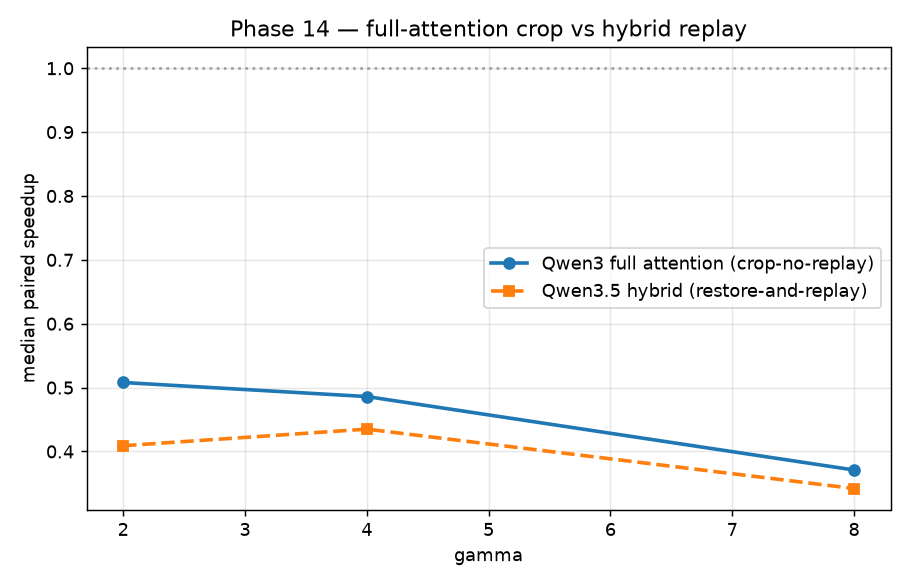
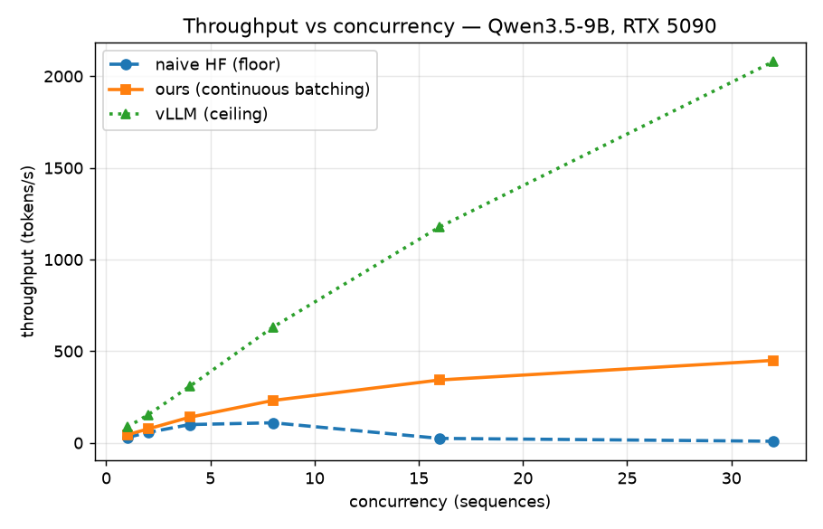
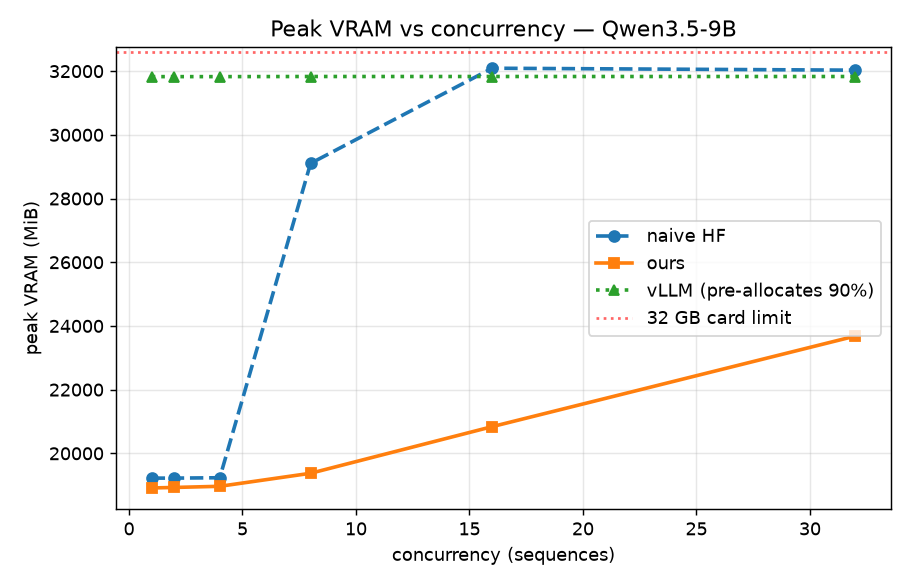
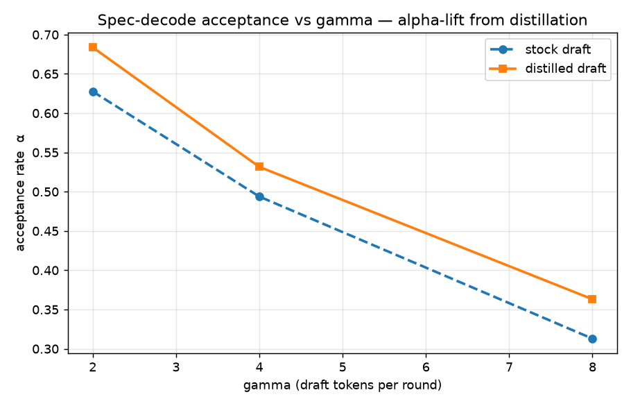
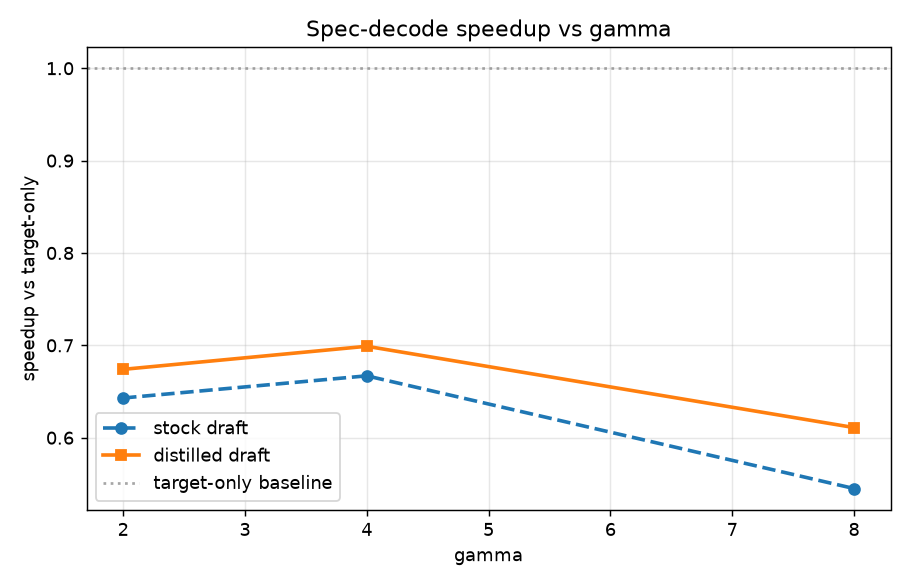

# inferd — Benchmark & Correctness Report

> Auto-generated by `bench/run_all.py`. Every number traces to a `result.json` under `bench/results/`; regenerate with `uv run python bench/run_all.py --plots`.

## Environment

| field | value |
|---|---|
| gpu_name | NVIDIA GeForce RTX 5090 |
| cuda_version | 13.0 |
| driver_version | 610.74 |
| torch | 2.11.0+cu130 |
| transformers | 5.3.0 |
| python | 3.13.14 (main, Jun 23 2026, 15:18:27) [Clang 22.1.3 ] |
| git_commit | 93b6d41 |
| vram_total_mb | 32607 MiB |

## Phase 14 — full-attention crop versus hybrid replay



| pair / reconciliation | gamma | alpha | wall (s) | median speedup | repeat range | result |
|---|---|---|---|---|---|---|
| phase14-full / crop-no-replay | 2 | 0.557 | 67.877 | 0.508× | 0.507–0.510× | negative |
| phase14-full / crop-no-replay | 4 | 0.424 | 71.203 | 0.486× | 0.483–0.505× | negative |
| phase14-full / crop-no-replay | 8 | 0.260 | 92.962 | 0.371× | 0.369–0.387× | negative |
| phase14-hybrid / restore-and-replay | 2 | 0.608 | 72.014 | 0.409× | 0.406–0.414× | negative |
| phase14-hybrid / restore-and-replay | 4 | 0.500 | 73.029 | 0.435× | 0.431–0.441× | negative |
| phase14-hybrid / restore-and-replay | 8 | 0.292 | 89.331 | 0.342× | 0.338–0.346× | negative |

## Throughput vs concurrency (three rungs)

Cohort: `4cc2a02e4b534c5bbe9e47ae6ee71309` (provenance-validated).



| concurrency | naive HF (tok/s) | ours (tok/s) | vLLM (tok/s) |
|---|---|---|---|
| 1 | 29.5 | 44.1 | 85.5 |
| 2 | 56.6 | 75.8 | 152.5 |
| 4 | 99.9 | 139.9 | 307.8 |
| 8 | 109.6 | 231.4 | 631.4 |
| 16 | 24.5 | 343.2 | 1177.8 |
| 32 | 8.9 | 449.9 | 2079.1 |

### Headline

- **Ours vs vLLM ceiling at c=32 (headline):** 449.9 vs 2079.1 tok/s → within **4.62×** of the production engine, from scratch — the stable, reproducible comparison (both engines are KV-cached/paged).
- **Ours vs naive HF floor:** continuous batching wins at **every** measured concurrency; the naive floor has no KV cache and collapses past c=8 on quadratic recompute.
- At c=32 the naive floor is VRAM-thrash-limited and **not reproducible** (measured 8.9–27.7 tok/s across repeats), so ours-vs-HF there is a **range of ~16–50×**, reported as a range rather than a single point.

### Reproducibility (c=1 & c=32 repeat)

Independent repeat of c=1 and c=32 (cohort `58111f09ec134de5b02815631c66e2dc` vs main `4cc2a02e4b534c5bbe9e47ae6ee71309`). The **vLLM ceiling ratio at c=32 is stable**: 4.62× vs 4.56× (-1.4%). ours and vLLM reproduce within ~2%; the **naive-HF floor at c=32 does not** (it thrashes at the 32 GB card edge), which is exactly why the ours-vs-HF ratio there is reported as a range.

| rung | c=1 main | c=1 repeat | Δ% | c=32 main | c=32 repeat | Δ% |
|---|---|---|---|---|---|---|
| hf | 29.5 | 28.9 | -2.0 | 8.9 | 27.7 | 211.5 |
| ours | 44.1 | 43.6 | -1.2 | 449.9 | 457.3 | 1.6 |
| vllm | 85.5 | 86.5 | 1.1 | 2079.1 | 2084.4 | 0.3 |

## Peak VRAM vs concurrency



## Speculative decoding — correctness is the differentiator






**stock draft** (target-only baseline 10.0 tok/s):

| gamma | alpha | tok/s | speedup |
|---|---|---|---|
| 2 | 0.628 | 6.5 | 0.643 |
| 4 | 0.494 | 6.7 | 0.667 |
| 8 | 0.313 | 5.5 | 0.545 |

**distilled draft** (target-only baseline 10.1 tok/s):

| gamma | alpha | tok/s | speedup |
|---|---|---|---|
| 2 | 0.684 | 6.8 | 0.674 |
| 4 | 0.532 | 7.0 | 0.699 |
| 8 | 0.363 | 6.1 | 0.611 |

- **Alpha-lift from draft distillation:** Δα up to **+0.056** (mean +0.048).

## Distribution-equivalence correctness gate

**✅ PASS** — multi-token per-position TV test, n=1500, length=6, gamma=4.

Spec-decode passed the distribution-equivalence gate: per-position TV distance fell within the bootstrapped direct-vs-direct null (99th pctile). This is statistical evidence for the accept rule and residual resampling implementation.

```
[correctness] prompt[2] pos[0] TV=0.0000 null_p99=0.0000 -> PASS
[correctness] prompt[2] pos[1] TV=0.0213 null_p99=0.0453 -> PASS
[correctness] prompt[2] pos[2] TV=0.0233 null_p99=0.0560 -> PASS
[correctness] prompt[2] pos[3] TV=0.0407 null_p99=0.0613 -> PASS
[correctness] prompt[2] pos[4] TV=0.0113 null_p99=0.0540 -> PASS
[correctness] prompt[2] pos[5] TV=0.0133 null_p99=0.0500 -> PASS
```
